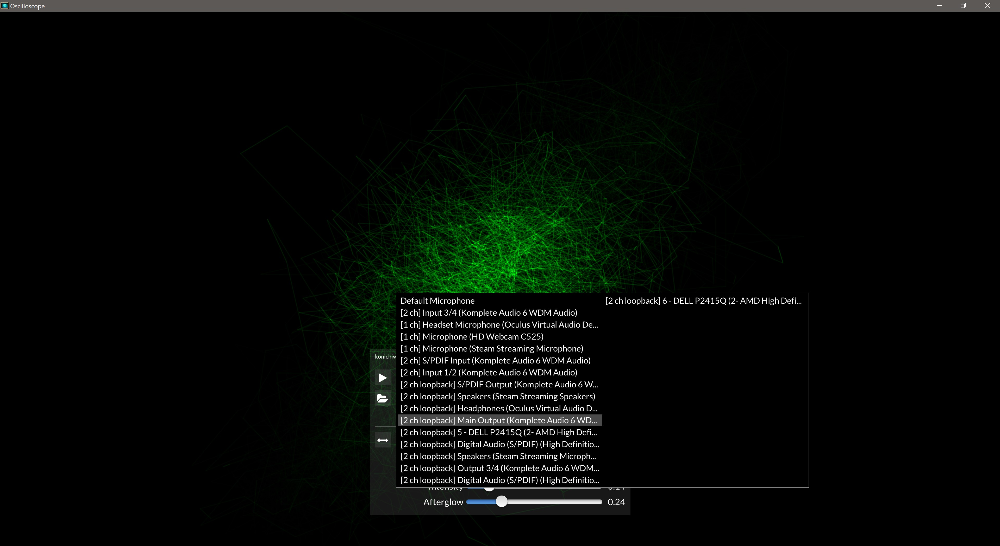
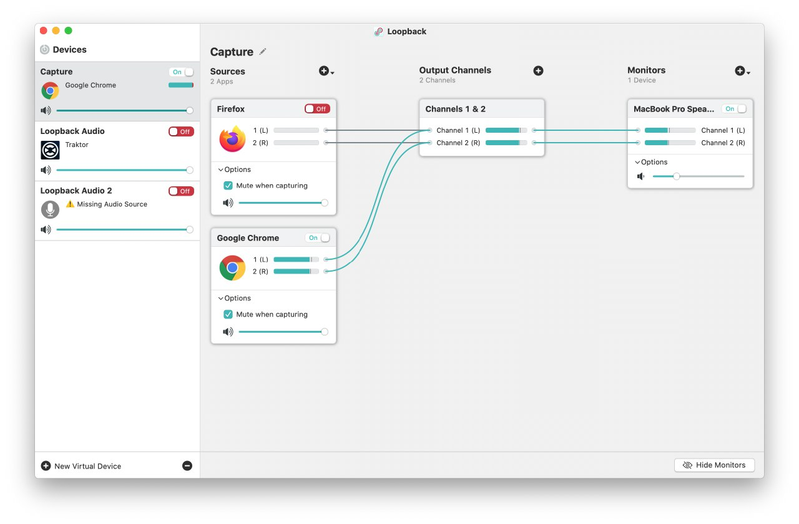
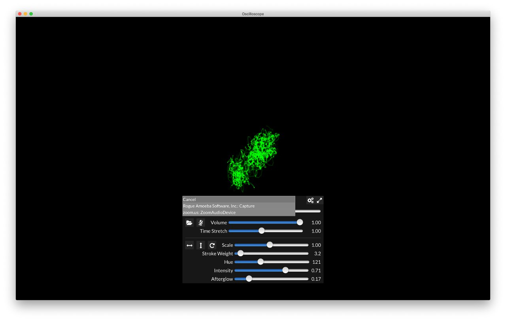
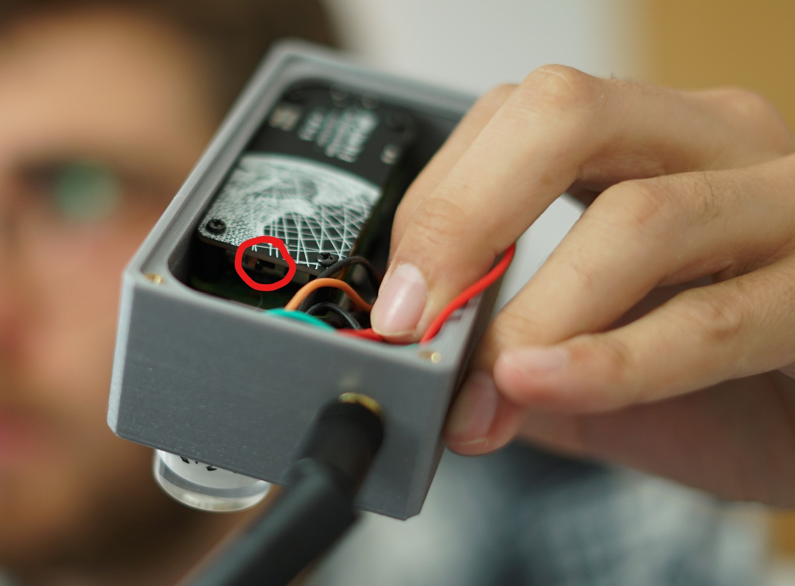

# Set-up of the Magnetoscope Interaction

There's four main parts to the system (well, a couple more, but they should be running continuously and don't require setup).

## 1. Sound engine 🔊

The sound engine is running at [frequency-station-sound.vercel.app](https://frequency-station-sound.vercel.app/). Open the link (Chrome and Firefox work best) and leave it open.

## 2. The oscilloscope 📈

This can either be a physical oscilloscope, or more likely, a digital oscilloscope app.

The [digital oscilloscope](https://github.com/kritzikratzi/Oscilloscope/releases/tag/1.0.8) (links to v1.0.8) is a bit tricky to set up on MacOS.

### Windows

On Windows you're better off downloading the experimental [1.0.15](https://asdfg.me/up/oscilloscope/Oscilloscope-1.0.15-win64.zip), since it's much easier to set up. Once the app is opened click on the microphone and select you main sound card (likely called `[2ch loopback] Speakers`).

### MacOS

On MacOS you need [LoopBack](https://rogueamoeba.com/loopback/) to capture the sound coming from the sound engine. This is paid software, but during the first 20 minutes it works without issues. You should configure loopback to capture the sound coming from Chrome and/or Firefox. The steps to do so are as follows:

1. Add new virtual device, name it something you'll recognize, like `OscilloscopeLoopback`
2. Add Firefox and/or Chrome at sources, and make sure it's turned on
3. Add the speakers to monitors

It should look something like this

You're ready to open the oscilloscope app. Click on the microphone icon and select your Loopback device (`Rogue Amoeba Sofware, Inc: OscilloscopeLoopback`).

## 3. The 'Magnetoscope' 📡

Turning the magnetoscope on should be fairly straightforward, but comes with some caveats.

### Connect to WiFi

The device needs to be connected to the internet. Provided you're able to connect to `Sherlocked`'s portable hotspot. You can skip this step.

I've previously set it up to connect to `Sherlocked`'s portable hotspot. However, if it needs to connect to a different WiFi point, this isn't trivial. Anyone familiar with a Raspberry Pi would be able to help you though. WiFi can be configured through `wpa_supplicant.conf`, of which I've provided an [example](docs/wpa_supplicant.conf). Please call me if you need help.

### Turning the device on

Turning the device on is as easy as unscrewing the bottom (inbus) and finding the power switch. Close the device again.

It takes about a minute for the device to fully boot up, at which point you should see some values change at the sound engine.

## 4. Beacons 📶

You're almost there! This is actually pretty easy. Since the beacons are able to run continously for multiple years, they are always on. I've marked each of them with a triangle 🔺, square 🟥 or circle 🔴, according to the sound they correspond with. They should all be as far away from each other as possible for the best results.
